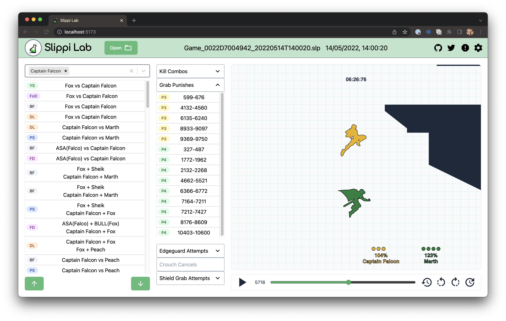

<p align="center">
  <a href="https://slippilab.com" target="_blank" rel="noopener noreferrer">
    
  </a>
</p>

# Slippi Lab - Aparoid Integration

Slippi replays in the browser. This is the code base for
[slippilab.com](https://www.slippilab.com), now integrated with Aparoid Lambda APIs.

## 🚀 Aparoid Integration Status

✅ **Infrastructure Deployed**: All AWS stacks are deployed and ready
✅ **API URLs Configured**: Lambda endpoints are configured in `src/config/api.ts`
✅ **Frontend Hosting**: CloudFront distribution ready at `https://d2hmlhyrbi3oq4.cloudfront.net`

### Available APIs:
- **Replay Stub API**: `https://mjln8hcpo5.execute-api.us-east-1.amazonaws.com/prod/`
- **Replay Data API**: `https://7htcacf9v4.execute-api.us-east-1.amazonaws.com/prod/`
- **Replay Tag API**: `https://0pfg8h7p4d.execute-api.us-east-1.amazonaws.com/prod/`



## Features

### Smooth instant playback

Replay files contain rich data about every frame: positions, action states,
inputs, and more. This lets us start playing from anywhere without resimulation
or hesitation. Combined with some replay-focused controls like frame-by-frame,
slowmo/fastforward, and short jumps (2s instead of 5s or 10s), we can offer an
unmatched viewing experience.

### Filters

Find replays within a folder quickly using a specific combination of characters,
stage, Slippi connect code, Slippi display name, or in-game nametag.

### Insights

Important moments in the selected replay are automatically detected and listed,
so less time is needed to find specific situations when browsing.

### Sharing

Upload your replay and grab a quick link to share a match with anyone.

## Limitations

### No realistic rendering

Without resimulating and/or using 3D models from the game, a lot of detailed
effects and realism are not possible:

- dynamic clothing effects like dresses, capes, and hair
- footsnap and other dynamic deviations from .slp positions like throws
  ("attach thrower bone X to throwee bone Y")
- perspective camera (we use orthographic)

### Ultra large datasets

While large data sets do run fine after taking time to parse (tested with 5k
replays), we can easily reach the limits of the machine's RAM space. We do some
tricks to save space:

- parse files in batches of a few hundred files at a time and close them all
  before starting the next batch
- only parsing enough of each file to provide filtering support
- only deeply parsing the currently playing file

These are good for most features, but still have scaling limits and close the
door slightly on some features like searching across all replays. A desktop app
(or maybe some fancy web API/library) could avoid some of these limits by
running a proper database of some kind.

## Development

The site is a Vite app primarily using SolidJS and Tailwind.

### Local Development

> `npm run dev`

### Build and Deploy

Build site:
> `npm run build`

Deploy to AWS:
> `./deploy.sh`

### API Integration

The frontend is now configured to communicate with the Aparoid Lambda APIs:

1. **API Configuration**: See `src/config/api.ts` for the configured endpoints
2. **API Client**: Use the `apiClient` instance for making requests
3. **Example Usage**: See `src/examples/api-usage.tsx` for usage examples

```typescript
import { apiClient } from './config/api';

// Query replay data
const result = await apiClient.queryReplayData('SELECT * FROM replay_data LIMIT 10');

// Process a replay
const processed = await apiClient.processReplay(replayData);

// Manage tags
const tags = await apiClient.getTags(replayId);
await apiClient.addTag(replayId, { name: 'favorite', value: 'true' });
```

## Thanks

The following projects and people are not associated with this project in any
way, but served as references or key dependencies and are greatly appreciated.

- [Project Slippi](https://github.com/project-slippi) by
  [Fizzi](https://twitter.com/Fizzi36) and the entire Project Slippi team

- [slippi-visualiser](https://github.com/schmooblidon/slippi-visualiser) by
  [schmooblidon](https://twitter.com/schmooDev)

- [react-slp-viewer](https://github.com/vinceau/react-slp-viewer) by
  [vinceau](https://twitter.com/_vinceau)

- [HSDraw](https://github.com/Ploaj/HSDlib) by [Ploaj](https://github.com/Ploaj)
